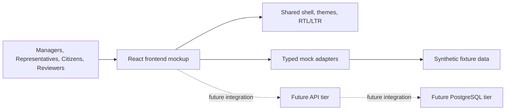

# Jutoverse Demo

`jutoverse_demo` is a frontend-first live mockup for AI-driven government-service optimization use cases derived from RFIs `7197`, `7190`, `7192`, and `7632`.

The current implementation is a polished `React + TypeScript + Vite` application with:

- six navigable feature areas
- Hebrew RTL and English LTR support
- typed mock adapters instead of a backend
- token-driven theming and GCP-oriented visuals adapted from `/Users/omid/projects/react-poc`
- resizable, collapsible, and expandable workspace panels

## Current Runtime Shape



## Feature Areas

- `Overview`
- `Service Operations`
- `Representative Assistant`
- `Citizen Services`
- `Research Review`
- `Administration`

## Local Development

```bash
npm install
npm run dev
```

Local deploy/debug helpers:

```bash
npm run deploy:local
npm run debug:local
```

The deploy helper starts a built preview on `127.0.0.1:4173` by default. The debug helper starts the Vite dev server on the same localhost address with hot reload.

You can override host and port:

```bash
npm run deploy:local -- --port 4174 --open
npm run debug:local -- --host 0.0.0.0 --port 3000
```

Validation commands:

```bash
npm run lint
npm run build
```

## Key Docs

- [docs/prd.md](docs/prd.md)
- [docs/ux-ui-style-contract.md](docs/ux-ui-style-contract.md)
- [docs/react-ux-implementation-plan.md](docs/react-ux-implementation-plan.md)
- [docs/frontend-only-implementation-plan.md](docs/frontend-only-implementation-plan.md)
- [docs/frontend-execution-assumptions.md](docs/frontend-execution-assumptions.md)
- [docs/agent-instructions.md](docs/agent-instructions.md)

## Notes

- The app is intentionally frontend-only today.
- Shared cloud deployment ownership remains outside this repo for GKE/platform and IaC concerns.
- The future `web -> api -> postgres` contract is preserved in the docs and in the mock adapter boundaries.
