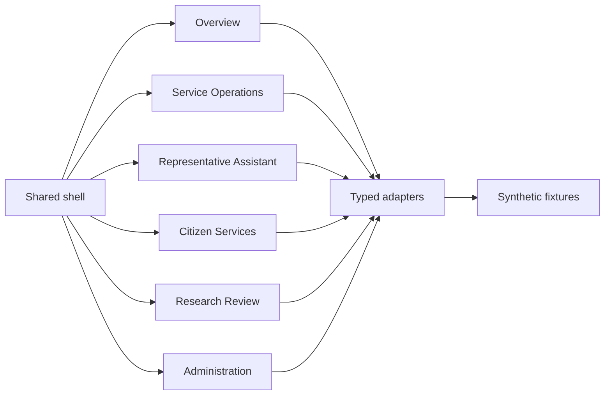

# Frontend-Only Implementation Plan

## Purpose

This document defines the detailed frontend-only execution plan for the initial implementation of `jutoverse_demo`.

It complements `docs/react-ux-implementation-plan.md` by intentionally focusing on the web tier only. It does not introduce backend, database, infrastructure, or Kubernetes implementation work.

The plan preserves the documented long-term architecture of `web`, `api`, and `postgres`, but it defines how to build the React experience now using mock adapters and frontend-owned workflow state.

Concrete implementation assumptions for the first end-to-end build are recorded in `docs/frontend-execution-assumptions.md`.

## Source Alignment

This plan must remain aligned with:

- `docs/prd.md`
- `docs/ux-ui-style-contract.md`
- `docs/react-ux-implementation-plan.md`
- `docs/frontend-execution-assumptions.md`
- `docs/repo-ownership-model.md`
- `docs/agent-instructions.md`

The visual and interaction source of truth remains `/Users/omid/projects/react-poc`.

## Current Implementation Status

This plan is no longer theoretical only. The repository now includes a shipped frontend-only mockup that follows this document closely.

Implemented now:

- app shell and routing
- theme runtime and locale switching
- all six top-level work areas
- typed mock adapters and synthetic fixtures
- resizable, collapsible, and expandable panels
- responsive layouts validated across desktop, tablet, mobile, and Hebrew RTL

Still deferred:

- real backend integration
- production authentication
- real persistence and cloud runtime wiring

## Current Frontend Shape



## Frontend-Only Scope

### In Scope

- React application setup using `React + TypeScript + Vite`
- application shell, routing, page structure, and navigation
- theme, tokens, localization, and RTL/LTR handling adapted from `react-poc`
- feature screens and workflows rendered with mock data
- typed frontend contracts for future API-aligned resources
- local mock adapters, fixtures, loading states, and error states
- accessibility, responsive behavior, and interaction polish
- GCP-oriented visual language and demo storytelling in the UI

### Out of Scope

- backend API implementation
- PostgreSQL schema or migrations
- authentication provider integration
- infrastructure, Terraform, IAM, DNS, TLS, or Kubernetes assets
- shared DEV or PROD deployment work
- direct integration with `Vertex AI`, `Document AI`, `BigQuery`, `Cloud Storage`, or `Cloud SQL`

### Boundary Rule

The frontend may simulate future product behavior, but it must not blur ownership boundaries or create temporary patterns that would fight the future `web -> api -> postgres` architecture.

## Core Implementation Principles

### Reuse First

- Port or closely adapt the token and theme runtime from `react-poc` before creating new styling primitives.
- Reuse shell, card, badge, control, filter, and focus patterns from `react-poc`.
- Keep `Jutoverse` as the default presentation layer.

### Frontend Architecture Discipline

- Build every feature against typed resource contracts even when the source is mock data.
- Keep business logic shallow in the web tier.
- Treat AI outputs as structured records returned by an adapter layer, not ad hoc component state.
- Keep feature modules organized around workflows and resource boundaries.

### Direction and Accessibility

- Treat Hebrew RTL as a first-class baseline.
- Preserve English LTR support.
- Keep layouts Arabic-ready through logical CSS properties only.
- Preserve keyboard accessibility, visible focus states, reduced-motion support, and semantic controls.

### Demo Realism Without Backend Coupling

- Use asynchronous mock adapters so the UX behaves like a real application.
- Include realistic loading, empty, partial, and error states.
- Simulate long-running workflows such as document processing or proposal analysis through frontend-controlled state transitions rather than fake backend code.

## Frontend Runtime Model

### Local Runtime

The frontend-only phase should run as a standalone web application without requiring an API or database service.

Recommended local behavior:

- `vite` dev server for day-to-day development
- mock adapters inside the frontend codebase
- fixture data checked into the repo
- optional simulated latency and failure toggles for UX validation

### Future Compatibility Rule

Even though no backend is implemented in this phase:

- route data access through a dedicated adapter layer
- avoid direct fixture imports inside page components
- keep contracts shaped like future API resources
- avoid browser persistence unless there is a clear UX reason

## Recommended Frontend Stack

### Core

- `React`
- `TypeScript`
- `Vite`
- `React Router`

### Recommended Supporting Libraries

- `@tanstack/react-query` or equivalent for async query lifecycle, even when backed by mocks
- `zustand` or scoped React context for UI-only shared state where local component state is insufficient
- `react-hook-form` for complex form flows
- `zod` for contract validation and typed parsing of fixture data

These are implementation recommendations, not hard requirements, but the app should avoid ad hoc state sprawl.

## App Shell Plan

### Shell Goals

- provide one consistent navigation model across all demo workstreams
- keep page titles, actions, filters, and status affordances visually predictable
- make section switching obvious and keyboard-accessible
- preserve the centered, disciplined shell style established in `react-poc`

### Required Shell Elements

- global header with app identity
- primary navigation for the six top-level product areas
- locale and direction controls adapted from `react-poc`
- shared page-heading and action region
- reusable content container and spacing system
- consistent card, panel, and toolbar patterns

### Suggested Route Map

- `/`
- `/overview`
- `/service-operations`
- `/representative-assistant`
- `/citizen-services`
- `/research-review`
- `/administration`

Detail views may initially use drawers, tabs, or in-page panels rather than deep route nesting unless a route materially improves clarity.

## Information Architecture

### Top-Level Areas

The frontend should implement these primary areas from the first iteration:

1. `Overview`
2. `Service Operations`
3. `Representative Assistant`
4. `Citizen Services`
5. `Research Review`
6. `Administration`

### Navigation Rules

- Keep navigation persistent and consistent across all areas.
- Avoid section-specific navigation patterns that contradict the shell.
- Prefer explicit labels over icon-only navigation.
- Keep quick actions and global utilities in predictable locations.

## Feature Delivery Plan

### Phase 0: Foundation

Deliver the baseline application structure before feature work begins.

Required outputs:

- React/Vite/TypeScript app initialization
- theme provider and global styles adapted from `react-poc`
- RTL/LTR and locale wiring
- provider composition and router setup
- shell scaffolding and layout primitives
- base linting, formatting, and test conventions
- reusable loading, empty, and error-state components

Exit criteria:

- the app can switch between Hebrew RTL and English LTR
- the shell renders correctly on desktop and mobile
- shared tokens and baseline components are working before page-specific styling starts

### Phase 1: Shell and Overview

Build the shared shell and the first demo landing experience.

Required outputs:

- persistent navigation
- overview dashboard page
- KPI cards, alerts, and summary panels
- reusable dashboard grid and card patterns
- mock summary resource contracts and adapters

Suggested overview content:

- program-level metrics
- service quality alerts
- demand or workload trend snapshots
- recent proposal review activity
- entry points into major work areas

Exit criteria:

- the overview page feels like the authoritative landing surface for the demo
- all shell primitives used here are reusable by later modules

### Phase 2: Service Operations

Implement the monitoring and analysis workflow for service interaction operations.

Required outputs:

- interaction list or table
- anomaly flags and quality indicators
- inquiry taxonomy or channel categorization panels
- demand forecast summary widgets
- transcript or interaction detail drawer/panel
- filters, search, and saved-view placeholders

Suggested interaction states:

- normal
- flagged
- escalated
- awaiting review

Suggested content modules:

- transcript summary cards
- sentiment trend panel
- taxonomy distribution panel
- staffing forecast highlights
- channel breakdown cards

Exit criteria:

- a manager can review operational patterns and drill into flagged interactions without leaving the module

### Phase 3: Representative Assistant

Implement the representative-facing assistance workspace.

Required outputs:

- query input and prompt history region
- grounded answer card
- cited source list or side panel
- sentiment or conversation context indicators
- translation support panel
- answer feedback controls such as helpfulness or escalation markers

Suggested workflow:

1. representative enters a question
2. mock adapter returns grounded answer content
3. UI presents citations, confidence framing, and related source snippets
4. representative can mark the result as helpful, insufficient, or escalated

Exit criteria:

- the module clearly demonstrates grounded assistance rather than generic chat
- sources are visually present and treated as first-class evidence

### Phase 4: Citizen Services

Implement the citizen-service workflow surface.

Required outputs:

- intake queue or request list
- document upload placeholder with progress states
- extracted field review panel
- identity-verification assistance indicators
- status and payment summary cards
- secure self-service flow placeholders

Suggested workflow slices:

- intake review
- extraction preview and correction
- case or request status lookup
- payment/status snapshot
- after-hours support path

Exit criteria:

- the module demonstrates lower-friction service handling and secure status visibility

### Phase 5: Research Review

Implement the proposal screening and recommendation workflow.

Required outputs:

- proposal queue
- proposal detail view
- criteria-aligned scoring summary
- strengths and weaknesses summary blocks
- recommendation panel
- traceability region showing why a recommendation was produced

Suggested workflow:

1. reviewer opens queue
2. reviewer selects proposal
3. UI shows extracted metadata, summary, criteria fit, and recommendation framing
4. reviewer can mark for follow-up, shortlist, or committee escalation

Exit criteria:

- the workflow feels auditable and committee-oriented
- recommendation content is clearly framed as preliminary rather than final adjudication

### Phase 6: Administration

Implement the initial operational and governance surface.

Required outputs:

- settings placeholder views
- data-source status tiles
- audit visibility tables
- workflow configuration placeholders
- environment or source-health summaries where useful for the demo

Exit criteria:

- the app has a coherent operational home for configuration and audit concepts even if many controls remain read-only placeholders

### Phase 7: Polish and Hardening

Refine the full frontend before introducing real backend integration.

Required outputs:

- responsive cleanup across modules
- RTL/LTR audit and fixes
- accessibility pass
- motion and reduced-motion pass
- empty/loading/error-state pass
- visual consistency review against `react-poc`
- mock-data cleanup and fixture normalization

Exit criteria:

- no page looks like a disconnected prototype
- the experience feels like one coherent application

## Screen-Level Expectations

### Overview

The overview should include:

- headline KPI cards
- current alerts or exceptions
- cross-workstream activity summary
- quick links into high-value workflows
- concise trend and health panels

### Service Operations

The service operations module should include:

- searchable interaction inventory
- anomaly review workflow
- channel and taxonomy summaries
- demand forecast or staffing insight cards
- transcript or case detail presentation

### Representative Assistant

The assistant module should include:

- query composer
- answer and citations
- context or sentiment sidebar
- translation-assist state
- representative action feedback

### Citizen Services

The citizen services module should include:

- intake/work queue
- extraction preview and structured-field review
- verification support indicators
- status and payment summary surfaces
- self-service oriented outcome states

### Research Review

The research review module should include:

- queue and sorting controls
- proposal detail summary
- criteria-aligned recommendation framing
- strengths, risks, and missing-information summaries
- audit-friendly traceability view

### Administration

The administration module should include:

- audit table or event list
- source health or ingestion status
- settings placeholders
- environment or governance cards where useful for the demo narrative

## Data Contract and Mocking Plan

### Adapter Strategy

Every feature should retrieve data through typed adapters or repository-style modules, even in frontend-only mode.

Recommended layering:

1. feature hooks call a resource adapter
2. the adapter returns typed records shaped like future API responses
3. fixtures or generators back the adapter
4. simulated latency and errors are introduced in the adapter layer

### Initial Contract Areas

Define typed contracts for at least:

- dashboard summary metrics
- alerts and notifications
- service interactions and transcripts
- inquiry classification and channel taxonomy
- staffing or demand forecast summaries
- grounded assistant answers and source citations
- translation assistance state
- citizen requests, status, and payment summaries
- document extraction results
- proposal records, score summaries, and recommendations
- audit events and configuration summaries

### Mock Data Rules

- keep fixtures realistic but compact
- model multiple states, not just success cases
- include empty, partial, stale, and failed records where helpful
- avoid putting mock objects directly inside page files

## State Management Boundaries

### UI State

Keep these concerns in local component state or feature-local stores:

- filter selections
- drawer open/close state
- active tabs
- sort order
- transient form progress

### Async Resource State

Keep these concerns in a query or async-state layer:

- dashboard metrics
- interaction lists
- assistant answers
- extraction results
- proposal queue and detail content
- audit history

### Avoid

- duplicating server-shaped data across many local stores
- storing large workflow records in browser storage without a strong UX reason
- encoding database-specific assumptions in UI components

## Folder Structure Recommendation

```text
src/
  app/
    providers/
    router/
    layout/
  theme/
  i18n/
  assets/
  components/
    common/
    shell/
    cards/
    forms/
    tables/
    charts/
    feedback/
  features/
    overview/
    service-operations/
    representative-assistant/
    citizen-services/
    research-review/
    administration/
  api/
    contracts/
    adapters/
    mocks/
  hooks/
  lib/
  pages/
  types/
```

The implementation should remain feature-oriented rather than growing into a single generic shared-components bucket.

## Styling and Reuse Order

Implement frontend styling in this order:

1. port the shared token and theme runtime from `react-poc`
2. port global styles and shell-safe layout rules
3. port localization and direction patterns
4. port or adapt shared controls and badges
5. reuse GCP icon assets
6. build new feature views on top of those primitives

Do not start by styling feature pages with new one-off CSS before the shared token system is in place.

## Accessibility and RTL Quality Gates

The frontend-only implementation is not acceptable unless it preserves:

- Hebrew RTL behavior across the full shell
- English LTR behavior across the full shell
- logical CSS usage instead of left/right assumptions
- visible focus states
- semantic buttons and interactive controls
- `aria-pressed` where toggle state is expressed
- keyboard-accessible navigation and dialogs
- reduced-motion support
- readable contrast and clear hierarchy

## Demo UX Quality Gates

The experience should demonstrate:

- one coherent visual system
- strong information hierarchy
- credible government-service workflows
- GCP-only cloud visual language
- auditable framing of AI-generated outputs
- realistic loading, empty, and error states
- clear distinction between preliminary AI recommendations and human decisions

## Suggested Execution Sequence

If one frontend engineer is driving the first implementation, use this order:

1. foundation, theming, shell, and locale/direction support
2. overview page and shared dashboard primitives
3. service operations module
4. representative assistant module
5. citizen services module
6. research review module
7. administration module
8. accessibility, responsiveness, and visual hardening

## Definition of Done

This frontend-only plan is satisfied when:

- the React application shell is implemented
- all six top-level work areas are present and navigable
- the UI reuses the `react-poc` token and interaction baseline
- the app runs without a backend dependency
- typed mock contracts isolate page code from fixture details
- the frontend can evolve from mock adapters to real API integration without redesigning the shell
- RTL, accessibility, and visual consistency have been validated across the implemented screens
