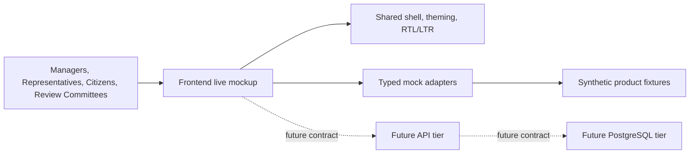
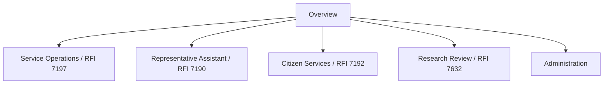

# Product Requirements Document (PRD): AI-Driven Government Service Optimization

## Document Overview

- **Document Status:** Draft
- **Program Context:** Consolidated response framework for RFIs `7197`, `7190`, `7192`, and `7632`
- **Primary Organizations:** Israeli National Digital System and Joint Israel
- **Document Purpose:** Define the product scope, delivery expectations, compliance constraints, and success criteria for AI-enabled modernization of government services
- **Reference UX/UI Contract:** `docs/ux-ui-style-contract.md`
- **Reference Ownership Model:** `docs/repo-ownership-model.md`
- **Reference Frontend Execution Plan:** `docs/frontend-only-implementation-plan.md`
- **Reference Frontend Assumptions:** `docs/frontend-execution-assumptions.md`
- **Reference Style Guide Repository:** `/Users/omid/projects/react-poc`
- **Demo Cloud Platform:** Google Cloud Platform (`GCP`)

## Executive Summary

The Israeli National Digital System, in collaboration with Joint Israel, is seeking AI capabilities that materially improve government service quality, operational efficiency, and citizen access.

This program spans four workstreams:

- service array optimization through integrated analysis of citizen interactions
- representative workflow enhancement through real-time knowledge and assistance tools
- citizen-facing digital service improvements that reduce friction and increase availability
- automated first-pass review of scientific research proposals

The expected outcome is a practical, secure, government-grade AI platform or set of capabilities that can support pilots and production use under Israeli regulatory, accessibility, and data-sovereignty constraints.

For this demo, delivery will reuse the frontend UX/UI system from `/Users/omid/projects/react-poc` and standardize all implementation work on GCP.

## Current Demo Implementation Status

The current implementation state in this repository is:

- a frontend-only live mockup built in `React + TypeScript + Vite`
- six navigable product areas aligned to the PRD workstreams and admin/governance needs
- typed mock adapters and synthetic fixtures instead of a backend API
- Hebrew RTL and English LTR support in the implemented shell
- GCP-oriented visuals, iconography, and storytelling reused from `react-poc`

The current implementation does not yet include:

- a production backend API
- PostgreSQL persistence
- real authentication or runtime identity integration
- real GCP service orchestration

## Current Demo Runtime Shape

## Background and Problem Statement

Current government service processes rely heavily on manual review, fragmented data, rigid categorization, and limited after-hours service access. These constraints create several operational problems:

- incomplete visibility into citizen interactions across channels
- slow knowledge retrieval for service representatives
- unnecessary manual data entry and identity-verification friction
- delayed administrative review processes for structured submissions such as research proposals

The target state is a measurable shift from fragmented human-driven workflows to supervised, auditable, AI-assisted operations that improve speed, consistency, and service quality without compromising privacy, accessibility, or regulatory obligations.

## Product Vision

Deliver a secure, Hebrew- and Arabic-capable AI service layer for government operations that:

- analyzes interactions at scale
- assists representatives in real time
- improves citizen self-service and accessibility
- accelerates structured administrative review workflows

The demo implementation should achieve this by reusing proven frontend design and code patterns from `react-poc` and by deploying the solution on a GCP-native technical stack.

## Goals

### Primary Goals

- Increase automation coverage across voice, text, and document-based service processes
- Reduce handling time and knowledge-search effort for service representatives
- Improve citizen experience through faster, more accurate, and more accessible digital services
- Shorten the time required for preliminary review of scientific proposals
- Preserve compliance with Israeli data, accessibility, and security requirements
- Reuse proven frontend code and UX patterns to reduce demo delivery risk and avoid parallel design-system work

### Business Outcomes

- better service quality monitoring
- more efficient workforce planning
- lower manual processing overhead
- improved responsiveness outside office hours
- more consistent and defensible administrative recommendations

## Non-Goals

The initial scope does not assume:

- fully autonomous government decision-making without human oversight
- replacement of existing core government systems in a single phase
- use of biometric identity verification for IVR identification
- unrestricted use of government data for third-party model training
- removal of human review from scientific proposal adjudication

## Stakeholders and Users

### Primary Stakeholders

- Israeli National Digital System
- Joint Israel
- government service operations leaders
- Ministry of Innovation, Science, and Technology
- information security, privacy, and accessibility teams

### Primary User Groups

- service center managers
- service representatives and case handlers
- citizens interacting through phone, web, and in-person channels
- review committees evaluating research proposals
- compliance and operational analytics teams

## Scope

### In Scope

- AI-driven analysis of citizen service interactions across voice and digital channels
- real-time representative assistance based on internal knowledge sources
- automated extraction and classification of citizen-submitted data
- secure self-service access to personal service information
- automated preliminary review of research proposals in PDF and DOCX formats
- analytics and reporting outputs for managers and review bodies
- reuse of the `react-poc` frontend style system, theme tokens, interaction patterns, and GCP visual assets
- GCP-native delivery of application runtime, AI services, storage, analytics, security, and observability

### Out of Scope for Initial Delivery

- wholesale migration of all legacy systems
- final automated approval or rejection of citizen requests
- final automated approval or rejection of research proposals
- generic consumer AI deployment without government-specific controls
- creation of a brand-new visual language separate from the `react-poc` design system
- implying that the current frontend mockup is already backed by real runtime systems or production data

## UX/UI and Frontend Reuse Strategy

### Reuse Baseline

The demo UX/UI baseline is defined by `docs/ux-ui-style-contract.md`, which in turn reuses the style and implementation patterns from `/Users/omid/projects/react-poc`.

### Mandatory Frontend Reuse Requirements

- Reuse the token-driven theme architecture from `react-poc` rather than inventing a new design system.
- Reuse or closely adapt the shared application shell, card system, controls, focus states, and interaction patterns.
- Reuse existing RTL/LTR-safe layout rules, especially for Hebrew-first screens.
- Reuse GCP iconography and cloud-oriented visual assets from the `react-poc` asset set.
- Use the `Jutoverse` theme direction as the default demo presentation while keeping compatibility with the shared token system.

### Preferred Reuse Artifacts

- `src/styles.css`
- `src/theme/themeCatalog.ts`
- `src/theme/ThemeProvider.tsx`
- `src/i18n/`
- `src/components/common/LocaleSwitch.tsx`
- `src/components/common/RegionBadge.tsx`
- `src/components/common/FlagIcon.tsx`
- `src/assets/gcp-icons/products/svg/`

### Frontend Delivery Principle

New screens for this demo should be built by adapting the `react-poc` frontend contract first. New primitives should be introduced only when an existing pattern cannot be extended cleanly.

## Workstream To Screen Mapping

## Functional Requirements

### Workstream 1: Service Array Optimization (RFI 7197)

**Objective:** Move from partial, manual monitoring to comprehensive automated analysis of service interactions.

#### Requirements

- **Automated Transcription and Quality Control:** Transcribe voice calls at full coverage and detect service anomalies in near real time, including tone issues, script deviations, and professional inaccuracies.
- **Intelligent Public Inquiry Cataloging:** Classify inquiries from email, web forms, and social media using semantic understanding rather than rigid legacy taxonomies.
- **Predictive Resource Management:** Forecast service demand using historical volumes, seasonality, and public events to improve workforce scheduling.
- **Deep Sentiment Analysis:** Extract recurring pain points, dissatisfaction drivers, and systemic service issues from open-text feedback and surveys.

#### Expected Outputs

- searchable transcripts
- quality alerts and trend reporting
- channel-level inquiry taxonomy and routing insights
- demand forecasts for staffing teams
- sentiment and pain-point dashboards

### Workstream 2: Representative Workflow Enhancement (RFI 7190)

**Objective:** Improve representative productivity and response quality through real-time assistance.

#### Requirements

- **Digital Assistant for the Representative:** Provide a semantic search and answer experience over internal procedures, circulars, and manuals, with answers grounded in approved sources.
- **Multi-Channel Sentiment Tracking:** Surface real-time citizen sentiment signals across phone, digital forms, and social platforms.
- **Real-Time Translation:** Support accurate official translation for frontal and telephone meetings in Arabic, Russian, and Amharic.

#### Expected Outputs

- grounded answer responses with source references
- representative-facing decision support during live interactions
- sentiment indicators by interaction and channel
- multilingual communication support for assisted service

### Workstream 3: Citizen Experience and Digital Services (RFI 7192)

**Objective:** Reduce bureaucratic friction and improve access to government services.

#### Requirements

- **Automated Entity Extraction:** Extract structured fields from scanned documents and long forms to reduce manual entry.
- **Smart Identity Verification:** Identify citizens in IVR systems without biometrics by evaluating interaction context, behavioral signals, and prior history.
- **24/7 Secure Access:** Enable secure after-hours access to sensitive personal information, including request status and payments, through digital channels.

#### Expected Outputs

- prefilled or auto-validated form fields
- lower manual handling volume
- improved IVR recognition success rates
- secure self-service flows outside standard office hours

### Workstream 4: Research Proposal Review (RFI 7632)

**Objective:** Accelerate the initial screening of scientific research proposals while preserving committee oversight.

#### Requirements

- **Automated Document Analysis:** Ingest PDF and DOCX proposals and rank them against predefined criteria.
- **Preliminary Recommendation Reports:** Generate concise summaries of strengths, weaknesses, and a primary recommendation for committee review.

#### Expected Outputs

- ranked proposal shortlist
- reviewer briefing summaries
- traceable reasoning aligned to evaluation criteria

## Non-Functional Requirements

### Language and Accessibility

- Full support for Hebrew, including RTL rendering and interaction patterns
- Demo delivery should preserve the existing Hebrew/English shell and direction model already implemented in `react-poc`
- Support for Arabic remains a target production requirement, and the reused CSS/layout contract must remain Arabic-ready
- Compliance with Israeli accessibility regulations

### Security and Privacy

- Government data must remain protected under approved privacy and security controls
- Solutions must support opt-out mechanisms to prevent government data from being used to train third-party models
- Access to sensitive citizen data must be authenticated, auditable, and role-appropriate

### Infrastructure and Data Residency

- All demo implementation, deployment, storage, AI processing, analytics, and observability will run on GCP
- Prefer GCP-managed services for application runtime, AI, document processing, storage, analytics, identity, secrets, logging, and monitoring
- Store and process data within approved GCP regions aligned with Israeli data-sovereignty requirements, with preference for Israel-hosted regional deployment where required by policy
- Support architectures compatible with government hosting, logging, monitoring, and audit requirements on GCP
- The original source solicitations referenced AWS/Project Nimbus preferences; this demo PRD intentionally standardizes on GCP for delivery consistency and reuse of existing GCP-oriented assets

### Reliability and Auditability

- Outputs must be reviewable and attributable to source data or rules where applicable
- Human operators must be able to override or escalate AI-generated recommendations
- The platform must support operational monitoring and error handling for production use

## Demo Technical Platform (GCP)

All demo capabilities should be implemented on GCP-managed services.

### Platform Mapping

- **AI and Generative Workloads:** Use `Vertex AI` for managed AI workloads, orchestration, and model-backed assistant experiences.
- **Document Processing:** Use `Document AI` for OCR, form extraction, and document understanding workflows.
- **Analytics and Reporting:** Use `BigQuery` for structured analytics, operational reporting, and aggregated service insights.
- **Document and Data Storage:** Use `Cloud Storage` for input documents, exported artifacts, and staged processing assets.
- **Operational Relational Data:** Use `Cloud SQL for PostgreSQL` for application relational data in shared cloud environments.
- **Application Runtime:** Use Docker Compose for local development and `Google Kubernetes Engine (GKE)` as the planned shared DEV and PROD runtime target.
- **Security and Operations:** Use GCP-native identity, secrets, logging, and monitoring services for access control, auditability, and operational visibility.

### Regional Constraint

All GCP deployment contracts for this project use `europe-west1`.

This applies to shared DEV and PROD environments, application deployment assumptions, and related platform contracts in this repository.

## Deployment Strategy

### Local Development

- Local development should use Docker Compose.
- The local baseline is a three-tier stack: `web`, `api`, and `postgres`.
- Local Compose exists to support developer iteration and integration testing only.

### Shared DEV and PROD Environments

- Shared DEV and PROD environments should eventually run on GKE, not Docker Compose.
- The future DEV target aligns to `jtm-playground-dev` in `europe-west1`, with the IaC-documented cluster contract `jtm-playground-dev-euw1`.
- The future PROD target aligns to `jtm-playground-prod` in `europe-west1`, with the IaC-documented cluster contract `jtm-playground-prod-euw1`.
- The application should consume IaC outputs for environment wiring rather than hardcode project, cluster, ingress, or image-registry values.

### Ownership Model

The repository split for this project is defined in `docs/repo-ownership-model.md`.

- `/Users/omid/projects/jutomate-cloud-iac` should own GCP prerequisites such as GKE, Artifact Registry, static ingress IP contracts, Cloud SQL contracts, Workload Identity contracts, network policy prerequisites, and relevant Terraform outputs.
- `/Users/omid/projects/jutomate-tools` should own Kubernetes deployment and platform concerns for shared DEV and PROD environments, including Traefik, cert-manager, external-secrets, ingress wiring, and app deployment manifests or Helm charts.
- `/Users/omid/projects/jutoverse_demo` should own the application code, local Docker Compose development stack, Dockerfiles, app contracts, and app-level smoke logic.
- Shared-environment Kubernetes deployment assets should not be treated as app-owned in this project unless the ownership model is explicitly changed.

## Success Metrics

### Proposed Program-Level Metrics

- transcription coverage rate
- inquiry auto-classification accuracy
- reduction in average representative search time
- reduction in average handling time for supported workflows
- reduction in manual document data-entry workload
- successful after-hours self-service completion rate
- reduction in proposal triage turnaround time

### Proposed Quality Metrics

- grounded-answer precision for representative assistance
- anomaly-detection precision and recall
- translation quality for supported languages
- citizen satisfaction trend improvement across measured channels
- reviewer acceptance rate of AI-generated proposal summaries

## Assumptions and Dependencies

- Internal procedures, manuals, and historical interaction data are available in machine-readable or ingestible formats
- Government teams can define evaluation criteria, escalation rules, and approval boundaries for AI-assisted decisions
- Required integrations with telephony, digital forms, CRM, document repositories, and case-management systems are technically feasible
- Security and legal review will be required before production rollout of any citizen-facing or decision-support feature

## Risks and Mitigations

| Risk | Impact | Mitigation |
| --- | --- | --- |
| Low-quality source data or fragmented systems | Reduced model quality and unreliable outputs | Prioritize data inventory, normalization, and source ranking |
| Hallucinated or weakly grounded answers | Operational mistakes and trust erosion | Require retrieval grounding, source display, and human escalation |
| Sensitive data exposure | Compliance and public-trust failure | Enforce regional processing, access control, logging, and data minimization |
| Bias or unfair outcomes in automated recommendations | Legal and ethical risk | Add review checkpoints, bias testing, and override mechanisms |
| Accessibility gaps in digital channels | Exclusion of target populations | Validate against Israeli accessibility requirements early in design |
| Procurement mismatch between source RFIs and demo cloud choice | Reduced transferability from demo to procurement path | Treat GCP as a demo implementation assumption and document any cloud-specific dependencies explicitly |

## Delivery Roadmap and Key Dates

| Milestone | Date (RFIs 7190, 7192, 7197) | Date (RFI 7632) |
| --- | --- | --- |
| Clarification Questions | July 5, 2026 | Expired |
| Submission Deadline | July 12, 2026 | June 30, 2026 |
| Pilot/Demo Commencement | September 3, 2026 | July 1, 2026 |

> Note: The government may pay up to `50,000 NIS` for a selected pilot or proof of concept.

## Open Questions

- Which systems of record will be the authoritative source for citizen status, payments, and interaction history?
- What evidence standard is required for AI-generated recommendations in proposal review?
- What latency targets are acceptable for live representative assistance and translation?
- Which channels must be included in the initial pilot versus later rollout phases?
- What approval process is required to operationalize managed AI and data services on GCP for this demo?
